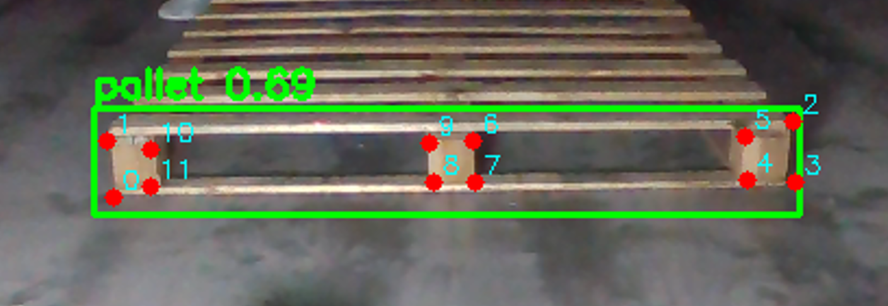

# 사용자 가이드 — Pose 라벨링 툴

## 목차

1. [도구 소개](#1-도구-소개)
2. [접속 방법](#2-접속-방법)
3. [UI 레이아웃 한눈에 보기](#3-ui-레이아웃-한눈에-보기)
4. [시작하기: 3단계 로드 순서](#4-시작하기-3단계-로드-순서)
5. [라벨링 방법](#5-라벨링-방법)
6. [키포인트 순서 규칙 (필독)](#6-키포인트-순서-규칙-필독)
7. [이미지 탐색 및 진행 확인](#7-이미지-탐색-및-진행-확인)
8. [Label Viewer 패널](#8-label-viewer-패널)
9. [작업 이어하기](#9-작업-이어하기)
10. [단축키 전체 목록](#10-단축키-전체-목록)
11. [단축키 커스터마이징](#11-단축키-커스터마이징)
12. [클래스 색상 변경](#12-클래스-색상-변경)
13. [문제 해결 FAQ](#13-문제-해결-faq)

---

## 1. 도구 소개

**Pose 라벨링 툴**은 이미지에 바운딩 박스와 키포인트(스켈레톤)를 함께 그려 Pose 추정 모델의 학습 데이터를 만드는 도구입니다. 브라우저에서 바로 실행되며 별도 설치가 필요 없습니다.


**작업 결과물**

저장하면 아래와 같은 ZIP 파일이 생성됩니다.

```
annotations_2024-01-15.zip
├── image1.json   ← 작업 재개용 데이터 (전체 이미지)
├── image1.txt    ← YOLO Pose 또는 MF_YOLO 학습용 TXT (객체 있는 이미지만)
└── ...
```

**권장 브라우저**: Chrome

---

## 2. 접속 방법

아래 주소를 브라우저에서 엽니다.

**https://mindforge-inc.github.io/pose-labeler/**

---

## 3. UI 레이아웃 한눈에 보기

화면은 크게 5개 영역으로 구성됩니다.

| 영역 | 위치 | 주요 요소 |
|------|------|-----------|
| **헤더** | 상단 전체 | Config 열기, 이미지 폴더 열기, 라벨 폴더 열기, 전체 JSON 저장(ZIP), 이전/다음 버튼, 단축키 설정(톱니바퀴) |
| **왼쪽 사이드바** | 좌측 (토글) | Label Viewer(JSON/YOLO/MF_YOLO 탭), Image List(그리드/목록 뷰) |
| **캔버스** | 중앙 | 이미지 표시, 모드 표시기(노란 배너), 십자선 가이드 |
| **오른쪽 패널** | 우측 | 감마 조정 슬라이더, 클래스 선택기 + 색상 점, 객체 목록, 키포인트 목록(좌표 · Visibility) |
| **푸터** | 하단 전체 | 파일명, 이미지 크기, 마우스 좌표, 줌 비율 |

왼쪽 사이드바는 아이콘 버튼으로 열고 닫을 수 있으며, 경계선을 드래그해 너비를 조절할 수 있습니다.

> [!TIP]
> 오른쪽 패널 상단의 **감마 조정** 슬라이더로 어두운 이미지를 밝게 보정해 키포인트를 더 정확히 찍을 수 있습니다. 값은 브라우저에 저장되어 다음 접속 시에도 유지됩니다.

---

## 4. 시작하기: 3단계 로드 순서

> [!IMPORTANT]
> 아래 순서를 반드시 지켜야 합니다. 순서를 건너뛰면 버튼이 비활성화 상태로 남습니다.

### ① Config 파일 로드 (필수)

헤더의 **Config 열기** 버튼을 클릭하고 준비한 Config JSON 파일을 선택합니다.

**Config 형식** — 클래스별 키포인트 라벨과 스켈레톤 연결 정보를 담은 JSON 객체입니다.

```json
{
  "person": {
    "labels": ["nose", "left_eye", "right_eye", "left_shoulder", "right_shoulder"],
    "skeleton": [[0, 1], [0, 2], [3, 4]]
  },
  "vehicle": {
    "labels": [],
    "skeleton": []
  }
}
```

- `labels` 배열의 **순서 = 키포인트 인덱스**입니다 (첫 번째 항목 = 0번).
- 키포인트가 필요 없는 클래스(바운딩 박스만)는 `labels`/`skeleton`을 빈 배열로 둡니다.
- `skeleton`은 `[시작 인덱스, 끝 인덱스]` 쌍의 배열로, 캔버스에 뼈대 선을 그리는 데만 사용됩니다.
- 로드에 성공하면 버튼이 초록색 **"Config 로드됨"** 으로 바뀝니다.

> [!WARNING]
> 형식이 잘못되면 오류가 표시됩니다. `config/pose_config.json`, `config/pallet_config.json` 등 예제 파일을 참고하세요.

### ② 이미지 폴더 열기 (필수)

Config 로드 후 활성화된 **이미지 폴더 열기** 버튼을 클릭하고 라벨링할 이미지가 들어있는 폴더를 선택합니다.

- PNG, JPG, JPEG 파일을 인식합니다.
- 로딩 중에는 `이미지 로딩: 3/10` 형태의 진행 알림이 표시됩니다.
- 완료되면 버튼이 초록색 **"폴더 로드됨"** 으로 바뀌고 첫 번째 이미지가 캔버스에 표시됩니다.

> [!NOTE]
> 하위 폴더 안의 이미지는 인식되지 않습니다. 이미지 파일이 한 폴더 안에 있어야 합니다.

### ③ 라벨 폴더 열기 (선택 — 이전 작업 이어하기)

**라벨 폴더 열기** 버튼을 클릭하면 라벨 형식을 선택하는 모달이 뜹니다.

- **기존 라벨**: 이 툴로 저장한 ZIP을 압축 해제한 폴더를 불러와 작업을 재개합니다. 자세한 내용은 [9. 작업 이어하기](#9-작업-이어하기)를 참고하세요.
- **Sapiens 라벨**: 외부 Sapiens 포맷 라벨을 불러옵니다.

---

## 5. 라벨링 방법

### 라벨링 퀵 가이드

바쁜 작업자를 위한 핵심 흐름 요약입니다. 자세한 설명은 아래 각 항목을 참고하세요.

1. **마우스 휠**로 이미지를 확대/축소합니다.
2. **`Alt` + 드래그**로 이미지를 움직여 원하는 위치를 봅니다.
3. **숫자키(`1`~`9`)**를 눌러 클래스를 고르고 바운딩 박스를 그려 객체를 추가합니다.
4. 키포인트를 **목록에 나열된 순서대로** 클릭해 라벨링합니다.
5. 현재 객체 편집을 끝내려면 **`Esc`**를 눌러 빠져나옵니다.
6. 박스를 수정하려면 **네 꼭짓점 핸들**을 잡고 드래그합니다.

### 클래스 선택

오른쪽 패널 상단의 드롭다운에서 클래스를 선택하거나, 숫자키 `1`~`9`로 즉시 선택합니다.

- 숫자키는 Config 객체의 키 순서를 따릅니다 (1번 = 첫 번째 클래스).
- 숫자키를 누르면 클래스 선택과 동시에 그리기 모드로 진입합니다.

### ① 바운딩 박스 그리기

1. **+ 객체 추가** 버튼을 클릭하거나, 숫자키로 클래스를 선택합니다.
2. 캔버스 상단에 노란색 배너 **"BBOX 그리기 모드"** 가 나타납니다.
3. 캔버스에서 **클릭한 채로 드래그** 하여 바운딩 박스를 그립니다.
4. 마우스를 놓으면 객체가 생성됩니다.

> [!WARNING]
> 바운딩 박스의 최소 크기는 **10×10 픽셀**입니다. 그보다 작으면 오류 메시지와 함께 취소됩니다.

### ② 키포인트(랜드마크) 찍기

박스를 그리고 나면 자동으로 **키포인트 편집 모드**로 전환되고, 오른쪽 패널의 키포인트 목록에 Config `labels` 순서대로 항목이 나타납니다. 목록의 첫 번째 항목이 선택된 상태로 시작합니다.

1. 캔버스에서 박스 안쪽을 클릭하면 **현재 선택된(하이라이트된) 키포인트**가 그 위치에 찍히고, 자동으로 **다음 키포인트로 이동**합니다.
2. 목록의 마지막 키포인트까지 찍으면 다시 첫 번째로 순환합니다.
3. 특정 키포인트를 다시 찍고 싶으면 오른쪽 키포인트 목록에서 해당 항목을 클릭해 선택한 뒤 캔버스를 다시 클릭합니다.
4. 이미 찍은 점은 드래그해서 위치를 조정할 수 있습니다.
5. 키보드 `A` / `S` 로 선택된 키포인트를 이전/다음으로 이동할 수 있습니다.
6. 키포인트 목록에서 X, Y 좌표를 직접 입력해 수정할 수도 있습니다.

`Escape` 키를 누르면 그리기 모드를 취소할 수 있습니다.

### Visibility(가시성) 설정

각 키포인트 항목 오른쪽의 라디오 버튼으로 가시성 값을 지정합니다.

| 값 | 의미 |
|----|------|
| `0` | 없음 (이미지 영역 밖에 있거나 존재하지 않음) |
| `1` | 가려짐 (다른 물체에 가려졌지만 위치 추정 가능) |
| `2` | 보임 (이미지 영역 안에서 명확하게 보임) |

### 바운딩 박스 편집

**크기 조정**: 선택된 박스의 네 모서리 핸들을 드래그합니다.

**클래스 변경**: 클래스를 변경하면 해당 클래스의 `labels` 구성에 맞춰 키포인트가 초기화됩니다.

박스를 클릭하면 선택되고, 빈 캔버스 영역을 클릭하면 선택이 해제됩니다.

### 객체 목록 관리

오른쪽 패널 중간의 객체 목록에서 현재 이미지의 모든 객체를 확인하고 관리합니다.

| 버튼 | 기능 |
|------|------|
| 눈 아이콘 | 객체 숨기기 / 보이기 토글 |
| 휴지통 아이콘 | 객체 삭제 |
| `Delete` / `Backspace` | 선택된 객체 삭제 |

> [!NOTE]
> 숨긴 객체는 캔버스에서 보이지 않지만 저장 시 데이터에 포함됩니다. 완전히 제거하려면 삭제하세요.

### 캔버스 탐색 (줌 / 패닝)

| 동작 | 결과 |
|------|------|
| 마우스 휠 | 줌 인 / 줌 아웃 (마우스 커서 위치 기준) |
| `Alt` + 드래그 | 캔버스 이동 (패닝) |

이미지를 전환하면 캔버스 뷰가 자동으로 초기화됩니다.

---

## 6. 키포인트 순서 규칙 (필독)

**키포인트는 화면에 찍는 순서가 아니라 Config `labels` 배열의 인덱스로 저장됩니다.** 즉 모든 이미지에서 **같은 이름의 랜드마크는 항상 같은 순서(같은 인덱스)로 찍어야** 학습 데이터가 일관됩니다. 순서가 흐트러지면 예를 들어 1번 이미지의 "왼쪽 눈" 좌표가 2번 이미지에서는 "오른쪽 어깨" 자리에 들어가는 식으로 라벨이 뒤섞여, 모델이 잘못된 좌표-의미 매핑을 학습하게 됩니다.

키포인트 편집 모드는 항상 Config에 정의된 순서대로 다음 키포인트로 자동 이동하므로, **목록에 나열된 순서 그대로 클릭**하면 자연스럽게 규칙을 지키게 됩니다. 임의의 순서로 여기저기 클릭하지 마세요.

### 예시: `pallet_config.json`

`config/pallet_config.json`은 파렛트(pallet)를 받치는 3개의 다리(블록) 모서리에 매겨진 총 12개의 키포인트를 정의합니다. 라벨은 `"0"`~`"11"` 숫자이며, 각 번호가 어느 모서리인지는 아래 예시 이미지로 정의됩니다.

```json
{
  "pallet": {
    "labels": ["0", "1", "2", "3", "4", "5", "6", "7", "8", "9", "10", "11"],
    "skeleton": [[0, 1], [1, 2], [2, 3], [3, 4], [4, 5], [5, 6], [6, 7], [7, 8], [8, 9], [9, 10], [10, 11]]
  }
}
```

아래 `docs/pallet_.png` 샘플 이미지에 각 번호(0~11)가 파렛트의 어느 지점에 오는지 표시되어 있습니다. 이 번호-위치 대응은 **모든 이미지에서 반드시 동일**해야 합니다. 예를 들어 이미지의 왼쪽 블록은 `0`·`1`·`10`·`11`, 가운데 블록은 `6`·`7`·`8`·`9`, 오른쪽 블록은 `2`·`3`·`4`·`5`가 매겨져 있으니, 새 이미지도 같은 물리적 지점에 같은 번호를 찍으세요.



> [!IMPORTANT]
> 모든 이미지에서 인덱스 `0`은 항상 첫 번째로, 인덱스 `11`은 항상 마지막으로 찍어야 합니다. 다른 작업자와 나눠 작업하더라도 이 순서 규칙은 반드시 동일하게 지켜야 하며, 검수 시 키포인트 목록의 인덱스와 좌표를 대조해 순서가 어긋난 이미지가 없는지 확인하세요.

---

## 7. 이미지 탐색 및 진행 확인

### 이미지 이동

- 헤더의 **이전 / 다음** 화살표 버튼 클릭
- 키보드: `Q` 또는 `←` (이전), `W` 또는 `→` (다음)
- 헤더 중앙의 진행 표시 (예: `3 / 47`) 로 현재 위치 확인

### Image List 패널

왼쪽 사이드바의 이미지 아이콘 버튼을 클릭해 패널을 열 수 있습니다.

- **그리드 뷰 / 목록 뷰** 전환 버튼으로 보기 방식을 변경합니다.
- 썸네일 크기 슬라이더로 미리보기 크기를 조절합니다.
- 작업이 완료된 이미지에는 **체크 표시**와 객체 수(obj N)가 표시됩니다.
- 이미지 항목을 클릭하면 해당 이미지로 바로 이동합니다.

---

## 8. Label Viewer 패널

왼쪽 사이드바의 코드(`<>`) 아이콘 버튼을 클릭해 패널을 열 수 있습니다.

| 탭 | 내용 |
|----|------|
| **JSON** | 내부 저장 형식의 원본 데이터 |
| **YOLO** | 이미지 전체 기준으로 정규화된 YOLO Pose 텍스트 형식 |
| **MF_YOLO** | 바운딩 박스 기준으로 정규화된 MF_YOLO 텍스트 형식 |

각 탭의 **복사** / **다운로드** 버튼으로 현재 이미지 파일 한 개를 저장할 수 있습니다.

> [!NOTE]
> 전체 이미지를 한 번에 저장하려면 헤더의 **전체 JSON 저장 (ZIP)** 버튼을 사용하세요.

---

## 9. 작업 이어하기

이전에 저장한 ZIP 파일로 작업을 재개하는 방법입니다.

1. 이전에 저장한 `annotations_YYYY-MM-DD.zip` 파일의 압축을 해제합니다.
2. **Config 열기** → 이전과 동일한 Config 파일을 로드합니다.
3. **이미지 폴더 열기** → 이전과 동일한 이미지 폴더를 선택합니다.
4. **라벨 폴더 열기** → 모달에서 **기존 라벨** 선택 후, 압축을 해제한 **폴더**를 선택합니다.
5. 이전 어노테이션이 자동으로 복원됩니다.

완료되면 이미지 목록에 이전 작업 이미지들의 체크 표시가 나타납니다.

> [!IMPORTANT]
> 이미지 파일명과 라벨 파일명이 **정확히 일치**해야 합니다.
> 예: `cat1.jpg` ↔ `cat1.json`
> 파일명이 다르면 해당 이미지의 라벨이 로드되지 않습니다.

---

## 10. 단축키 전체 목록

| 단축키 | 기능 |
|--------|------|
| `Q` / `←` | 이전 이미지 |
| `W` / `→` | 다음 이미지 |
| `1` ~ `9` | N번째 클래스 선택 + 그리기 모드 진입 |
| `A` | 이전 키포인트 선택 |
| `S` | 다음 키포인트 선택 |
| `Delete` / `Backspace` | 선택한 객체 삭제 |
| `Escape` | 동작 취소 / 선택 해제 |
| `Ctrl + Z` (Mac: `Cmd + Z`) | 실행 취소 |
| `Ctrl + S` (Mac: `Cmd + S`) | 전체 저장 (ZIP) |
| `Alt` + 드래그 | 캔버스 패닝 |
| 마우스 휠 | 줌 인 / 줌 아웃 |

---

## 11. 단축키 커스터마이징

1. 헤더 오른쪽의 **톱니바퀴 아이콘**을 클릭합니다.
2. 변경하고 싶은 기능 옆의 입력창을 클릭합니다.
3. 원하는 키를 누릅니다.
4. **저장** 버튼을 클릭합니다.

**기본값으로 초기화** 버튼을 클릭하면 모든 단축키가 원래대로 돌아갑니다.

---

## 12. 클래스 색상 변경

1. 오른쪽 패널 상단의 클래스 선택기 왼쪽 **색상 원**을 클릭합니다.
2. 색상 선택기에서 원하는 색을 고릅니다.
3. 변경 사항이 즉시 반영됩니다.

---

## 13. 문제 해결 FAQ

| 증상 | 원인 | 해결 방법 |
|------|------|-----------|
| "이미지 폴더 열기" 버튼이 클릭되지 않음 | Config를 아직 로드하지 않음 | Config 파일을 먼저 로드하세요 |
| 라벨이 로드되지 않음 | 이미지 파일명과 JSON 파일명이 다름 | 파일명이 일치하는지 확인하세요 |
| TXT 파일이 없음 | 해당 이미지에 객체가 없음 | 정상 동작입니다. 객체가 있는 이미지만 TXT가 생성됩니다 |
| 박스가 너무 작다는 오류 | 드래그 없이 클릭만 함 | 10×10 픽셀 이상이 되도록 드래그하세요 |
| 키포인트가 엉뚱한 순서로 들어감 | 목록 순서를 무시하고 임의로 클릭함 | [6. 키포인트 순서 규칙](#6-키포인트-순서-규칙-필독)을 참고해 항상 목록 순서대로 클릭하세요 |
| 페이지를 닫을 때 경고가 뜸 | 저장하지 않은 변경 사항이 있음 | `Ctrl + S`로 저장 후 닫으세요 |
| 폴더 선택이 되지 않음 | Chrome 이외의 브라우저 사용 중 | Chrome 브라우저를 사용하세요 |
